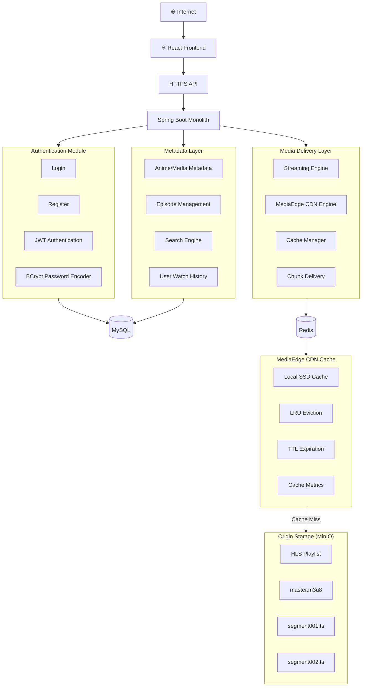

# 🏗️ MediaEdge - Low Level Architecture

MediaEdge is a Spring Boot based Media streaming platform featuring a custom CDN engine for low-latency media delivery. The application follows a modular monolithic architecture where each module has a clear responsibility while sharing the same application runtime.

## Low Level Architecture

---

## Architecture Overview

### Frontend
- React.js
- Responsive UI
- HLS Video Player
- JWT Authentication

### Backend
- Spring Boot 3
- Modular Monolith Architecture
- REST APIs
- Spring Security
- JWT Authentication

### Authentication Module
- User Registration
- Login
- BCrypt Password Encoding
- JWT Token Generation
- Authorization

### Metadata Module
- Anime/Media Information
- Episode Management
- Search API
- User Watch History

### Media Module
- HLS Streaming
- Custom CDN Engine
- Chunk Delivery
- Cache Management
- Streaming Metrics

### Database
**MySQL**
- Users
- Anime/Media
- Episodes
- Watch History

### Redis
- Streaming Session Cache
- Frequently Accessed Metadata
- Rate Limiting
- Temporary Streaming Data

### MediaEdge CDN Cache
- Local SSD Storage
- LRU Eviction Policy
- TTL-Based Expiration
- Cache Hit/Miss Tracking
- Background Cleanup Scheduler

### Origin Storage
- MinIO Object Storage
- HLS Playlists
- Video Segments
- Original Media Files

---

## Request Flow

1. Client requests a video.
2. Spring Boot authenticates the user.
3. Metadata service fetches anime and episode information.
4. Media service checks the CDN cache.
5. **Cache Hit:** Video chunk is served immediately.
6. **Cache Miss:** Chunk is downloaded from MinIO, cached locally, and streamed to the client.
7. Cache metrics are updated for monitoring.

---

## Tech Stack

| Layer | Technology |
|--------|------------|
| Frontend | React.js |
| Backend | Spring Boot |
| Security | Spring Security + JWT |
| Database | MySQL |
| Cache | Redis |
| Object Storage | MinIO |
| Streaming | HLS (.m3u8 + .ts) |
| Build Tool | Maven |
| Containerization | Docker |
