## 🔐 Authentication Module

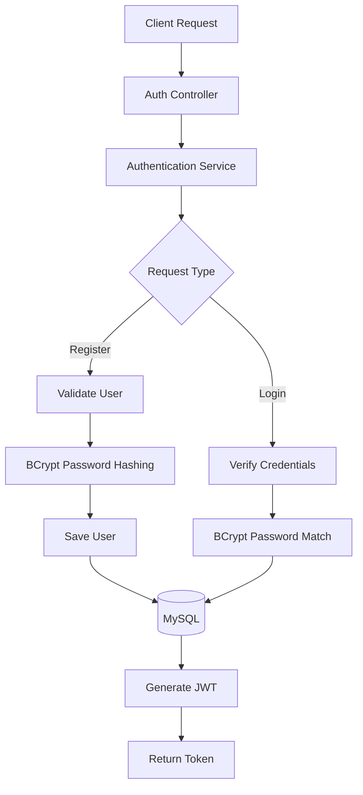

## 🎬 Anime/Media Module

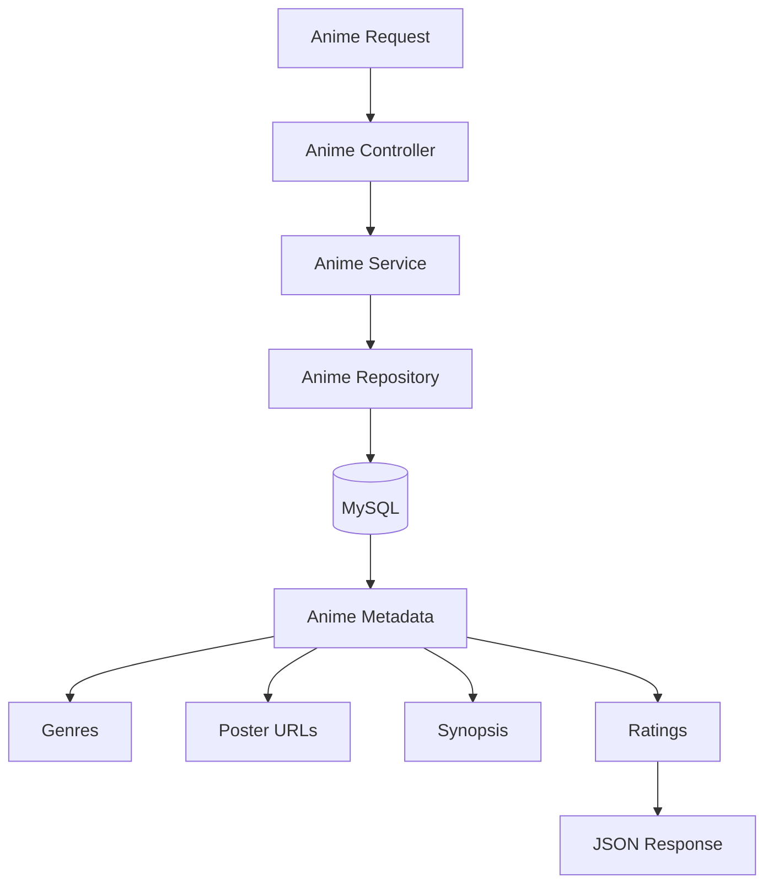

## 📺 Episode Module

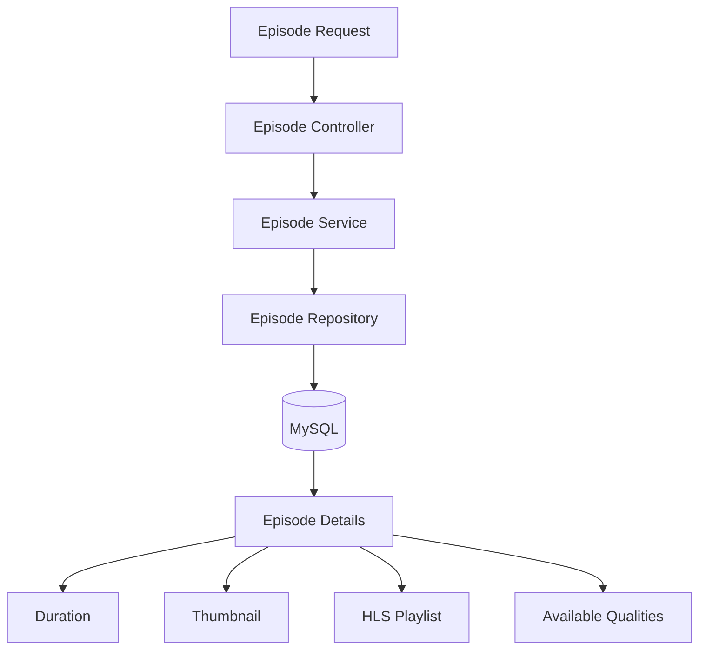

## 🔍 Search Module

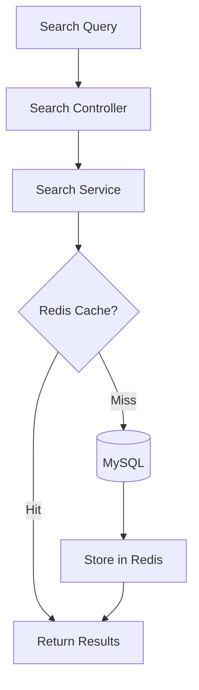

## 📜 Watch History Module

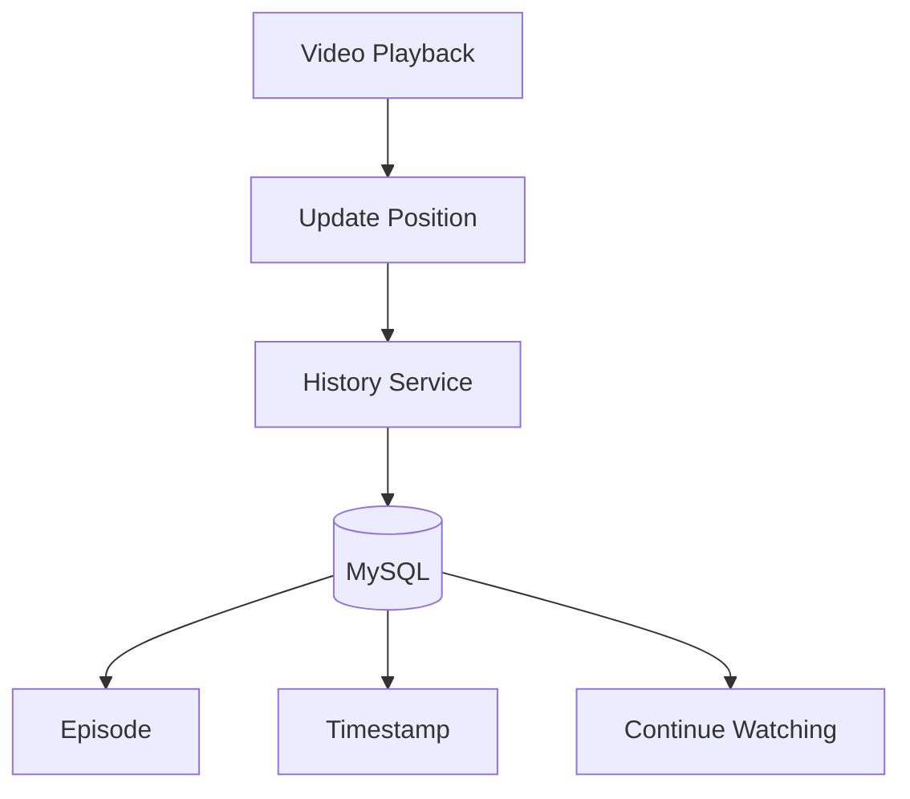

## ▶️ Streaming Module

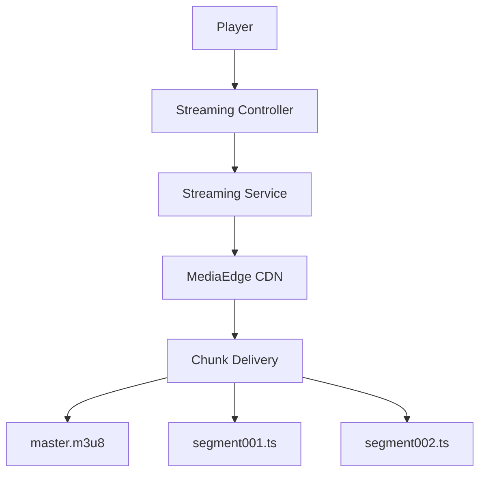

## 🚀 MediaEdge CDN Module

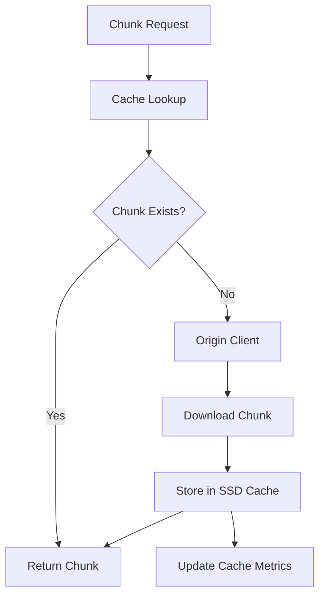

## 💾 Cache Module

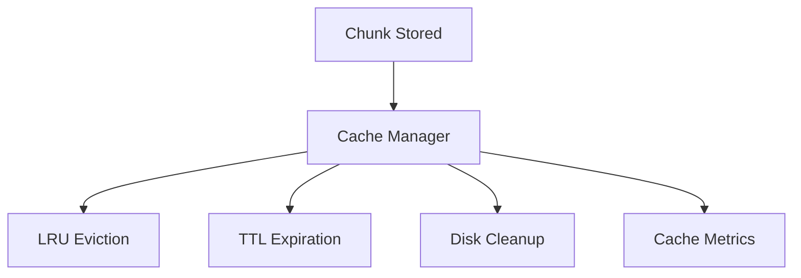

## 📦 Origin Module

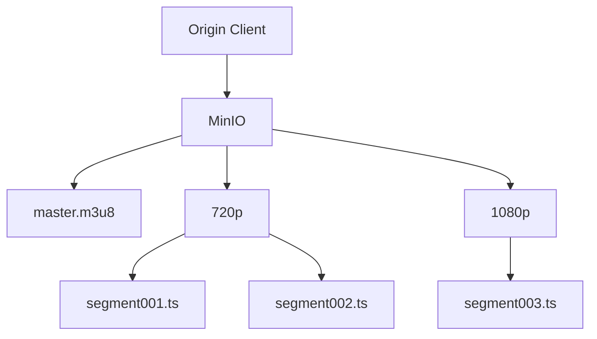

## ⬇️ Download Module

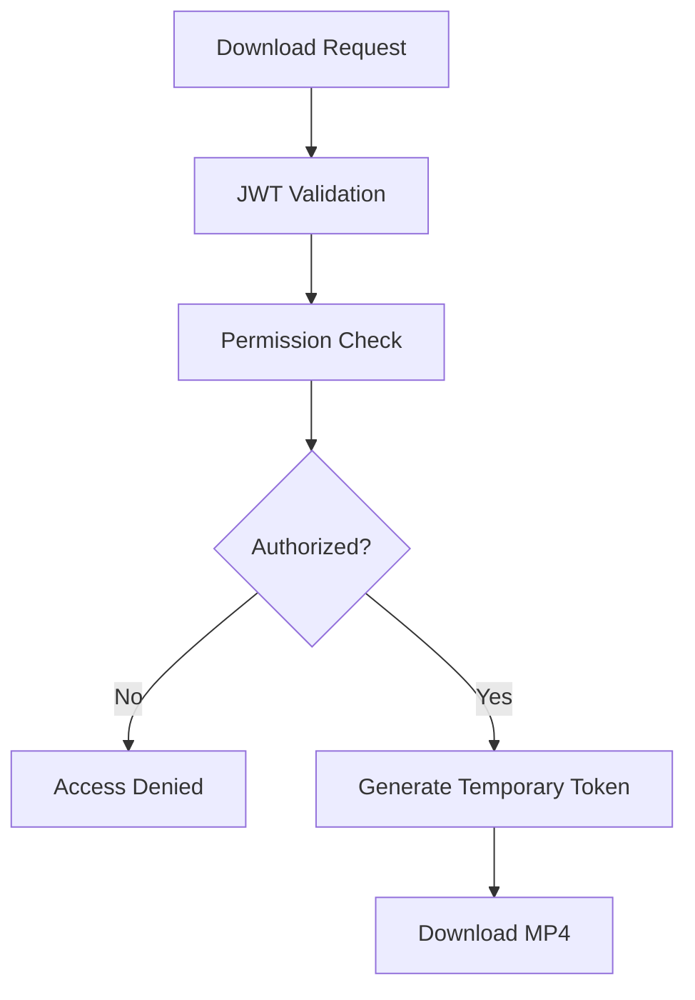

## 📈 Analytics Module

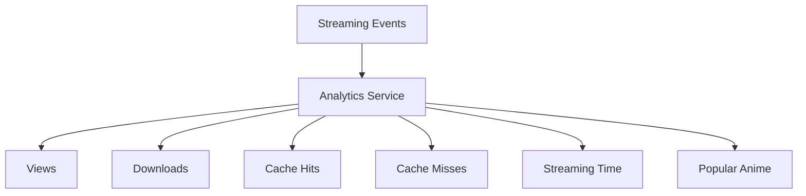

## ⚡ Redis Architecture

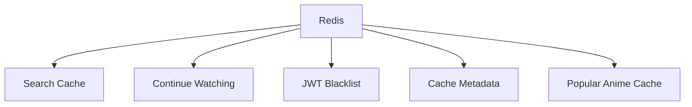

## 🗄️ MySQL Architecture

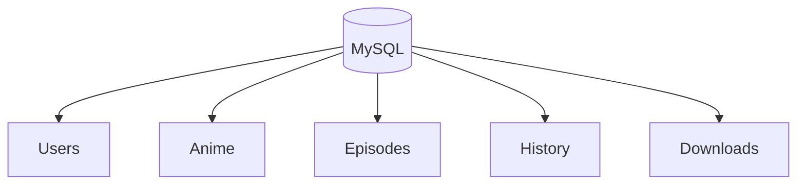

## 🎥 FFmpeg Processing

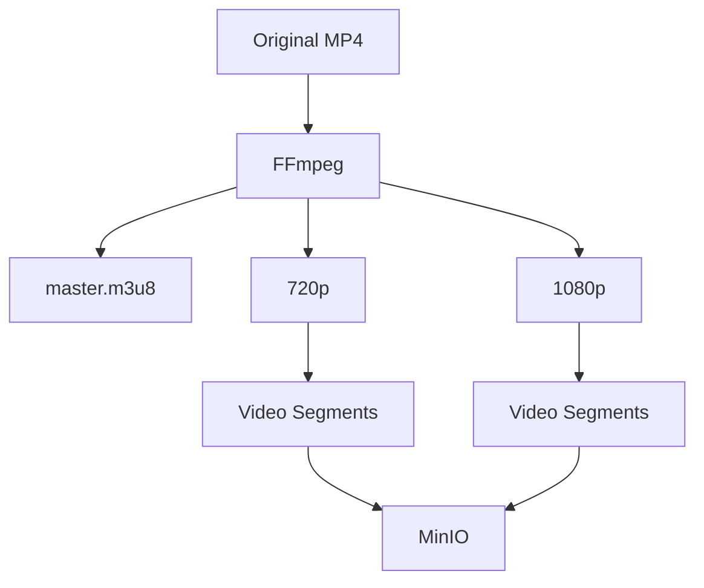

## ✅ Cache Hit Flow

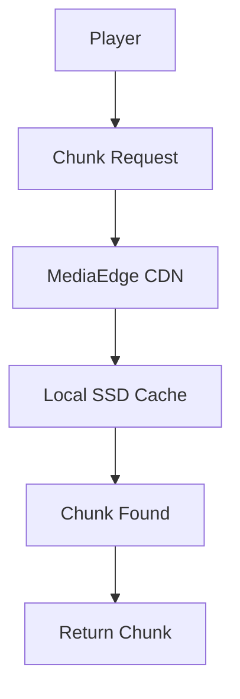

## ❌ Cache Miss Flow

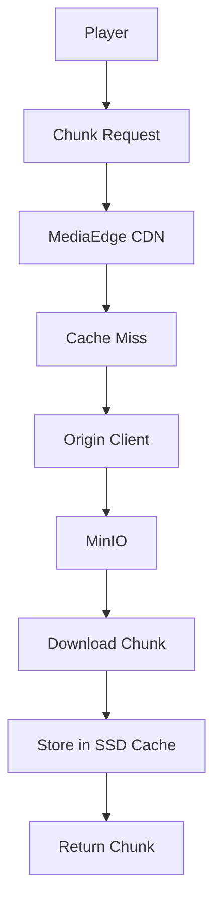

## ☁️ Future Expansion

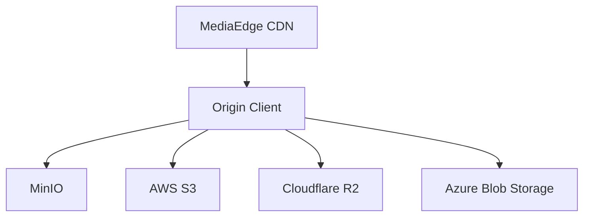

## 🏛️ Final Component Relationship

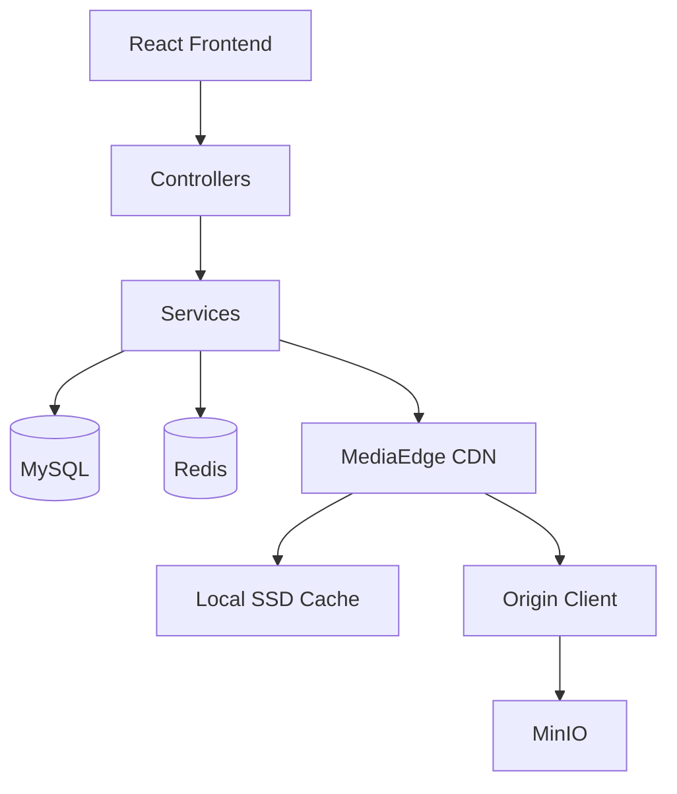
